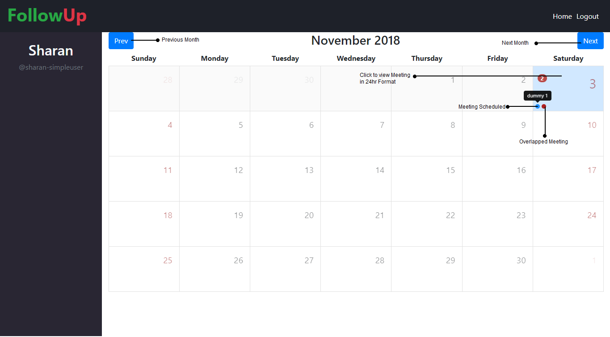

# Meeting Planner - Project Description

URL: http://planner.sharansingh.xyz

API Documentation: http://planner.sharansingh.xyz/apidoc

Socket.IO Events Documentation: http://planner.sharansingh.xyz/eventdoc

### Screenshots

#### Home Page

#### Calendar View:

### Usage

#### User Management

- To access the app, you need to have an account.
  - **Sign Up**
    - If you don't have an account, create an account, by clicking the "Sign Up".
    - Once you are in the Sign Up page fill the sign up form and submit it.
      - If you want to create an admin account, all you need to do is add '-admin' at the end of your username.
    - You will receive a mail with an activation link. You click that link, your account will be activated and you will be able to access the account.
  - **Login**
    - If you already have an account, fill the login form at the home page and click the "Login" button
    - Once logged in, you will be taken to the calendar page.
    - If you forgot your password, there is a link in the login form to go to the "Forgot Password" page.
    - In the "Forgot Password" page, submit your username. A password reset link will be sent to your email. You need to go that link to create new password. Then login.
  - **Errors**
    - If there are any errors while submitting any form, you either get an error message in the form of an alert box at the top right corner of the page.
- You can log out of your account by clicking the Logout in the navigation area.

#### Meetings Management

##### Admin
- Once you are logged in, you will be shown a list of normal users.
- You can go to the calendar view of any user by clicking on the user in the above list.
- There you can create a meeting for that user or click on any day to view the meetings of that day in a 24-hour timeline view.
- In the timeline view, you can create, delete or update a meeting.
- Every operation will pop up a modal with meeting details either to be displayed or updated.
- While performing an operation if error occurs then an alert box with an error message will be displayed at the top right corner of the screen.

##### Normal User
- Once you are logged in, you will taken to the calendar view.
- Here you can navigate through months or click on any day of a month to go to the timeline view.
- In the timeline view, you can see all the meetings for that particular day in 24-hour timeline format.
- Here you can click on any meeting to pop up a modal with the meeting details.
- You can also navigate through days in the timeline view using the Prev and Next Button to go to the previous or next day respectively.
- Any time an Admin creates or updates any of your meetings, you will get a notification in realtime. You can view all your notifications by clicking the 'Notification' in the navigation area.
- Before 1 minute of a scheduled meeting, a reminder mail is sent to your email and an alert is shown, which you can either snooze (to show another alert in 5 seconds) or dismiss.