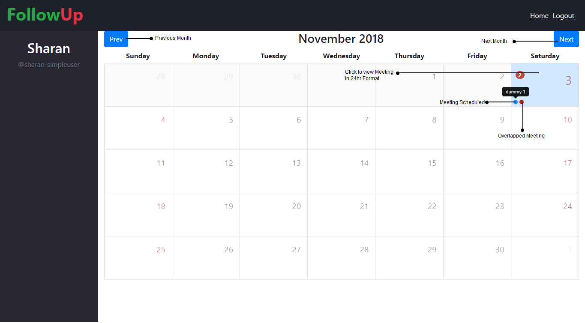

# FollowUp

This is a meeting planner application, where a user can see his/her meetings in calendar or 24-hour timeline format and an Admin can create/delete/update a meeting of any user he/she wants.

[Click here](http://planner.sharansingh.xyz) to check the app.

### Screenshot



### Built With
* Angular 6 & Bootstrap 4 - Frontend
* Angular-calendar - Calendar View
* Node.js & Express.js - Backend
* MongoDB - Database
* Socket.IO

### Prerequisites
1. MongoDB
2. Node.js

### Running the App

The steps you need to follow (assuming MongoDB is running):

```shell
git clone https://github.com/sharan3009/FollowUp-app.git
cd FollowUp-app/FollowUp-Backend
npm install
node index
```